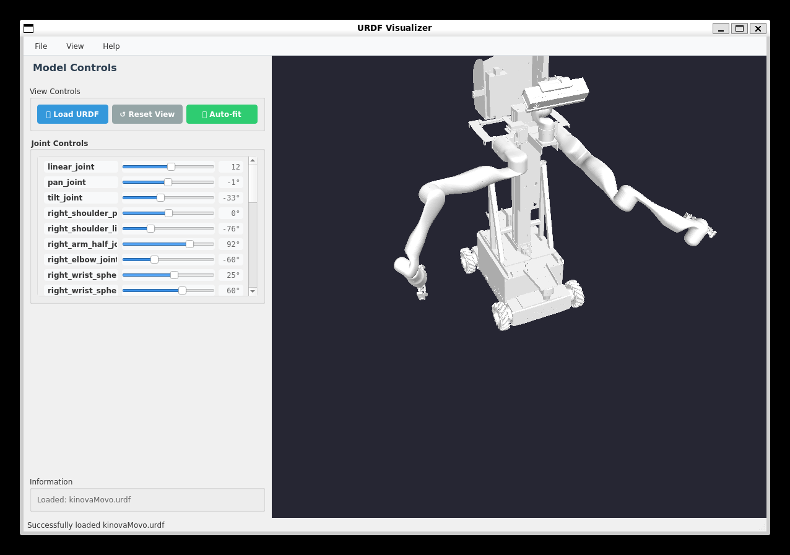

# URDF Visualizer

A Python application for visualizing URDF (Unified Robot Description Format) files using PyQt5 and OpenGL.

## Features

*   **3D Visualization:** View robot models defined in URDF format in an interactive 3D environment.
*   **Interactive Camera Controls:**
    *   **Orbit:** Left-click and drag to rotate the view around the model's center.
    *   **Pan:** Right-click and drag to move the view horizontally and vertically.
    *   **Zoom:** Use the mouse wheel to zoom in and out.
    *   **Reset/Auto-fit:** Quickly reset the view to a default position or automatically fit the entire model to the screen.
*   **Joint Manipulation:** Control revolute, continuous, and prismatic joints using intuitive sliders in the side panel.
*   **Geometry Support:**
    *   Basic primitives: Box, Sphere, Cylinder.
    *   Mesh files (requires `trimesh` library).
*   **Material Colors:** Accurately renders colors defined in the URDF's `<material>` tags.
*   **User-Friendly Interface:** Clean Qt-based GUI with separate panels for controls and 3D view.

## Screenshot



## Installation

### Prerequisites

*   **Python:** Version 3.8 or higher.
*   **pip:** Python package installer.

### Install from PyPI (if published)

```bash
pip install urdf-visualizer-pyqt
urdfviz # Run the application
```

### Install from Source

1.  **Clone or Download:** Clone this repository or download the source code.
2.  **Navigate:** Open a terminal and navigate to the directory containing `setup.py`.
3.  **Virtual Environment (Recommended):** Create and activate a virtual environment to isolate dependencies.
    ```bash
    python -m venv venv
    # On Linux/macOS:
    source venv/bin/activate
    # On Windows:
    # venv\Scripts\activate
    ```
4.  **Install:** Install the package in editable mode. This command also installs the required dependencies (`PyQt5`, `PyOpenGL`, `numpy`).
    ```bash
    pip install -e .
    ```
    *(Note: The `-e` flag installs the package in "editable" mode, meaning changes to the source code will be reflected without needing to reinstall.)*

### Install Optional Mesh Support

To visualize mesh files (`.stl`, `.dae`, etc.), you need the `trimesh` library and a backend like `python-fcl` or `meshplex` (trimesh will guide you). Install it separately or as an extra:

```bash
# Option 1: Install trimesh directly
pip install trimesh

# Option 2: If you installed the visualizer package, install the optional dependency
# pip install urdf-visualizer-pyqt[mesh] # (Adjust package name if different)
```

## Usage

### Running the Application

After installation, you can run the visualizer in several ways:

1.  **Using the installed script**
    ```bash
    urdfviz
    ```
2.  **Running the module directly:**
    ```bash
    python -m urdf_visualizer
    ```
    *(Make sure you are in the directory containing the `urdf_visualizer` package or have installed it.)*

### Loading and Interacting with a URDF

1.  **Launch:** Run the application using one of the commands above.
2.  **Load URDF:**
    *   Click the **"📂 Load URDF"** button in the control panel.
    *   Or use the menu: **File -> Load URDF...**
    *   Select your `.urdf` file in the file dialog.
3.  **View the Model:** The robot model should load and display in the 3D view area.
4.  **Navigate:**
    *   **Rotate View:** Click and hold the **Left Mouse Button** anywhere in the 3D view area, then drag the mouse.
    *   **Pan View:** Click and hold the **Right Mouse Button** anywhere in the 3D view area, then drag the mouse.
    *   **Zoom:** Scroll the **Mouse Wheel** up to zoom in, down to zoom out.
5.  **Manipulate Joints:**
    *   If the URDF contains controllable joints, sliders will appear in the **"Joint Controls"** panel.
    *   Adjust the sliders to change the joint angles or positions.
6.  **View Controls:**
    *   **↺ Reset View:** Click the "Reset View" button or use **View -> Reset View** (Ctrl+R) to return the camera to its default position.
    *   **🔍 Auto-fit:** Click the "Auto-fit" button or use **View -> Auto-fit View** (Ctrl+F) to automatically adjust the camera to fit the entire model in the view.
7.  **Information:** The **"Information"** panel at the bottom of the control panel shows details about the loaded model.

## Dependencies

*   `PyQt5`: For creating the graphical user interface.
*   `PyOpenGL`: For rendering 3D graphics using OpenGL.
*   `numpy`: For efficient numerical computations, especially with vectors and matrices.
*   `trimesh` (optional): Required for loading and rendering mesh files referenced in the URDF.

## Acknowledgements

*   This tool utilizes the power of `PyQt5`, `PyOpenGL`, `numpy`, and optionally `trimesh`.